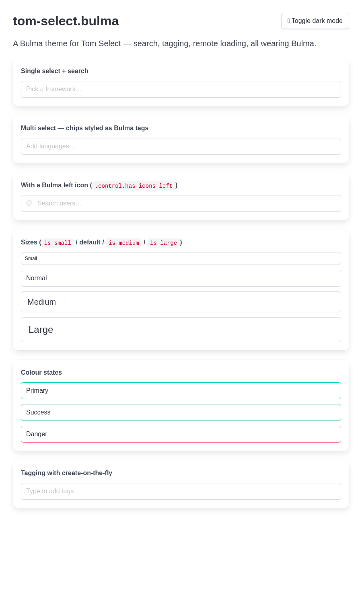

# tom-select.bulma

A [Bulma](https://bulma.io) theme for [Tom Select](https://tom-select.js.org) — the
lightweight, framework-agnostic select/autocomplete/tagging widget. Gives you Tom Select's
search, multi-select, remote loading and create-on-the-fly while looking like a native Bulma
control, **including automatic light/dark theme support** via Bulma's CSS variables.

Tom Select ships `default`, `bootstrap4` and `bootstrap5` themes — but no Bulma one. This is that
missing theme.



## Why a theme, not a fork

Tom Select is almost entirely *behaviour* — keyboard navigation, ARIA accessibility, remote
loading, tagging, plugins. Its styling is a thin SCSS layer with `!default` variables, exactly the
way the Bootstrap themes are built. So this is a **theme**, not a reimplementation: you keep every
Tom Select feature and bugfix, and only the appearance changes.

## How it works

The theme feeds Bulma's runtime CSS custom properties (`var(--bulma-*)`) straight into Tom Select's
own `!default` SCSS variables, then layers on the pieces the base doesn't parametrise (focus ring,
size/colour modifiers, icon slots, loading spinner, tag-styled chips). Because the colours resolve
to Bulma tokens at runtime, the control follows Bulma's `data-theme="dark"` toggle with **no
hardcoded colours** — every colour has a `var(--bulma-*)` with a Bulma-light fallback so it still
degrades gracefully if Bulma is absent.

## Install

```bash
npm install   # installs sass + tom-select + bulma (dev)
npm run dist  # builds dist/tom-select.bulma.css and .min.css
```

## Usage

Load Bulma, **this theme instead of `tom-select.css`** (it's self-contained — base + skin), and
Tom Select's JS:

```html
<link rel="stylesheet" href="bulma.min.css" />
<link rel="stylesheet" href="tom-select.bulma.css" />
<script src="tom-select.complete.min.js"></script>

<select id="framework" placeholder="Pick a framework…">
  <option value="">Pick a framework…</option>
  <option value="flask">Flask</option>
  <option value="django">Django</option>
</select>

<script>
  new TomSelect('#framework', {});
</script>
```

> Do **not** also load `tom-select.css` / `tom-select.default.css` — this theme already includes
> the base structure.

## Supported Bulma modifiers

Put Bulma's usual classes on the original `<select>` (Tom Select copies them onto the wrapper):

| Feature        | How                                                                                  |
| -------------- | ------------------------------------------------------------------------------------ |
| Sizes          | `class="is-small \| is-medium \| is-large"`                                          |
| Colour states  | `class="is-primary \| is-link \| is-info \| is-success \| is-warning \| is-danger"`  |
| Rounded        | `class="is-rounded"`                                                                  |
| Loading        | `class="is-loading"` on the wrapper (also responds to Tom Select's own `.loading`)   |
| Left/right icon | wrap in `<div class="control has-icons-left">` + `<span class="icon is-left">`      |
| Multi-select   | native `multiple` attr — chips render as Bulma tags; add the `remove_button` plugin   |
| Validation     | an invalid bound `<select>` gets Tom Select's `.invalid` → rendered as `is-danger`    |

## Dark mode

Nothing to configure. Toggle Bulma's theme as usual and the control follows:

```js
document.documentElement.setAttribute('data-theme', 'dark');
```

## Demo

Open [`demo/index.html`](demo/index.html) after `npm run build` — single/multi/remote/icon/size/colour
examples plus a dark-mode toggle.

## Project layout

```
src/tom-select.bulma.scss   the theme source (the only file you edit)
dist/tom-select.bulma.css   compiled, distributable CSS (+ .min.css)
demo/index.html             live examples
```

## Notes / limitations

- Built against **Bulma 1.0** (CSS-variable era) and **Tom Select v2**.
- A right-side icon (`has-icons-right`) overlaps the single-select caret; prefer left icons, or use a
  multi-select where there is no caret.
- The `dropdown_header` plugin's divider uses a CSS function the upstream SCSS emits in a non-standard
  form; the header still works, only that one divider tint may be unset.

## License

MIT.
