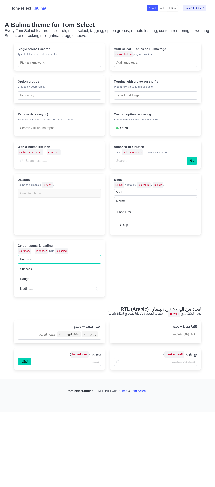
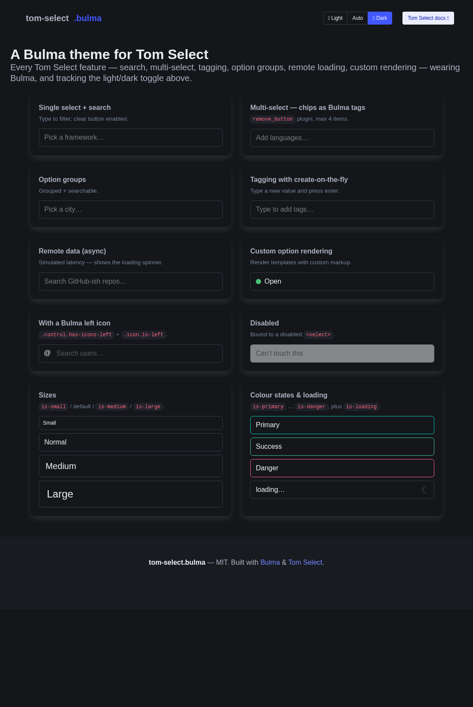
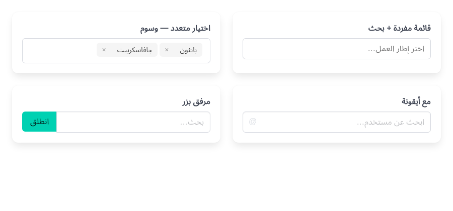
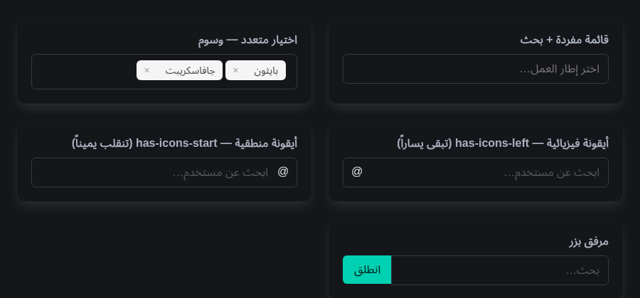

# tom-select.bulma

### ▶ [Live demo &amp; example gallery](https://raydapay.github.io/tom-select-bulma/)

A [Bulma](https://bulma.io) theme for [Tom Select](https://tom-select.js.org) — the
lightweight, framework-agnostic select/autocomplete/tagging widget. Gives you Tom Select's
search, multi-select, remote loading and create-on-the-fly while looking like a native Bulma
control, **including automatic light/dark theme support** via Bulma's CSS variables.

Tom Select ships `default`, `bootstrap4` and `bootstrap5` themes — but no Bulma one. This is that
missing theme.

> Community theme — not affiliated with or endorsed by the Tom Select or Bulma projects.

| Light | Dark |
| --- | --- |
|  |  |

## Why a theme, not a fork

Tom Select is almost entirely *behaviour* — keyboard navigation, ARIA accessibility, remote
loading, tagging, plugins. Its styling is a thin SCSS layer with `!default` variables, exactly the
way the Bootstrap themes are built. So this is a **theme**, not a reimplementation: you keep every
Tom Select feature and bugfix, and only the appearance changes.

## How it works

The theme feeds Bulma's runtime CSS custom properties (`var(--bulma-*)`) straight into Tom Select's
own `!default` SCSS variables, then layers on the pieces the base doesn't parametrise (focus ring,
size/colour modifiers, icon slots, loading spinner, tag-styled chips). Because the colours resolve
to Bulma tokens at runtime, the control follows Bulma's `data-theme="dark"` toggle with **no
hardcoded colours** — every colour has a `var(--bulma-*)` with a Bulma-light fallback so it still
degrades gracefully if Bulma is absent.

A common alternative is to **fork Tom Select's base CSS** and hand-edit it (e.g. replacing
properties with framework utilities + `dark:` variants). That works, but it copies the base, so it
needs manual re-syncing on every Tom Select release, bakes in fixed colour values, and needs a
dark-mode variant written on every rule. This theme instead **imports** the base and binds to
runtime tokens: Tom Select upgrades flow through on a rebuild, and dark mode / a customized Bulma
palette are tracked automatically with no per-rule work.

## Install

### CDN — no build step

jsDelivr serves it straight from this repo's release tag:

```html
<link rel="stylesheet"
  href="https://cdn.jsdelivr.net/gh/raydapay/tom-select-bulma@v0.1.0/dist/tom-select.bulma.min.css">
```

(You also need Bulma and Tom Select themselves — see [Usage](#usage).)

### With a bundler

Install from GitHub, pinned to a tag:

```bash
npm install github:raydapay/tom-select-bulma#v0.1.0
```

`bulma` and `tom-select` are peer dependencies — install them alongside if you haven't:

```bash
npm install bulma tom-select
```

The compiled CSS ships in `dist/` (`tom-select.bulma.css` + `.min.css`); the SCSS source is in
`src/` (import `tom-select-bulma/scss` to override Tom Select's `!default` variables yourself).

### Building from source

```bash
npm install   # sass + tom-select + bulma (dev)
npm run dist  # builds dist/tom-select.bulma.css and .min.css
```

## Usage

Load Bulma, **this theme instead of `tom-select.css`** (it's self-contained — base + skin), and
Tom Select's JS:

```html
<link rel="stylesheet" href="bulma.min.css" />
<link rel="stylesheet" href="tom-select.bulma.css" />
<script src="tom-select.complete.min.js"></script>

<select id="framework" placeholder="Pick a framework…">
  <option value="">Pick a framework…</option>
  <option value="flask">Flask</option>
  <option value="django">Django</option>
</select>

<script>
  new TomSelect('#framework', {});
</script>
```

> Do **not** also load `tom-select.css` / `tom-select.default.css` — this theme already includes
> the base structure.

## Supported Bulma modifiers

Put Bulma's usual classes on the original `<select>` (Tom Select copies them onto the wrapper):

| Feature        | How                                                                                  |
| -------------- | ------------------------------------------------------------------------------------ |
| Sizes          | `class="is-small \| is-medium \| is-large"`                                          |
| Colour states  | the full Bulma input set: `is-white`, `is-black`, `is-light`, `is-dark`, `is-text`, `is-primary`, `is-link`, `is-info`, `is-success`, `is-warning`, `is-danger` (coloured border + focus ring) |
| Rounded        | `class="is-rounded"`                                                                  |
| Loading        | `class="is-loading"` on the wrapper (also responds to Tom Select's own `.loading`)   |
| Left/right icon | wrap in `<div class="control has-icons-left">` + `<span class="icon is-left">`      |
| RTL-aware icon | `<div class="control has-icons-start">` + `<span class="icon is-start">` (or `-end`) — flips with `dir` (see RTL below) |
| Multi-select   | native `multiple` attr — chips render as Bulma tags; add the `remove_button` plugin   |
| Validation     | an invalid bound `<select>` gets Tom Select's `.invalid` → rendered as `is-danger`    |

## Dark mode

Nothing to configure. Toggle Bulma's theme as usual and the control follows:

```js
document.documentElement.setAttribute('data-theme', 'dark');
```

## Right-to-left (RTL)

Set `dir="rtl"` on a container (or the page) and everything flips — Tom Select adds its own
`.rtl` class automatically, and this theme uses CSS **logical properties** so the `has-addons`
corner-squaring and the loading spinner mirror correctly. Text alignment and the chip remove (`×`)
follow suit.

| RTL · Light | RTL · Dark |
| --- | --- |
|  |  |

**Icons in RTL.** `has-icons-left` / `has-icons-right` are **physical** by Bulma's own convention —
a left icon stays on the left in RTL (this theme matches Bulma exactly). If you want an icon that
**follows the writing direction**, use the logical variants this theme adds:

```html
<div class="control has-icons-start">
  <select id="search">…</select>
  <span class="icon is-start"><!-- … --></span>
</div>
```

`has-icons-start` / `has-icons-end` (with `icon.is-start` / `is-end`) sit on the inline start/end
and flip automatically under `dir="rtl"` — start = left in LTR, right in RTL. They work on a native
Bulma `.input` / `.select` too, so they're a usable forward-port of the fix proposed upstream
([jgthms/bulma#3981](https://github.com/jgthms/bulma/issues/3981)).

## Live demo

**→ https://raydapay.github.io/tom-select-bulma/**

The full example gallery — single / multi / option groups / tagging / remote / custom
rendering / icons / sizes / colours / loading, with a light–dark–auto theme switcher. The source
is [`docs/index.html`](docs/index.html); open it in a browser (it loads Bulma and Tom Select from a
CDN), or serve it locally:

```bash
npm run build:docs           # compile the theme into docs/
npx serve docs               # or any static server, then open the printed URL
```

### Hosting it on GitHub Pages

This site is published from the `docs/` folder via GitHub Pages (**Settings → Pages**, source
**`main` / `docs`**); every push to `main` that touches `docs/` redeploys it. Note GitHub Pages on
a **private** repo requires a paid plan (Pro/Team/Enterprise) — on a free account the repo must be
public.

## Project layout

```
src/tom-select.bulma.scss   the theme source (the only file you edit)
dist/tom-select.bulma.css   compiled, distributable CSS (+ .min.css)
docs/index.html             the live example gallery (GitHub Pages source)
docs/tom-select.bulma.css   compiled copy the demo loads
scripts/screenshots.sh      regenerates the README screenshots
```

## Regenerating screenshots

```bash
npm run screenshots
```

Renders `docs/screenshot-{light,dark}.png` and `docs/screenshot-rtl-{light,dark}.png` with headless
Chromium. The RTL shots use Arabic, so an Arabic font must be present — if none is found the script
installs **Noto Sans Arabic** into `~/.local/share/fonts` (no sudo). Without it, Arabic renders as
tofu boxes in the *screenshots only*; the theme itself is unaffected.

## Compared to the official Bootstrap 5 theme

Tom Select's `bootstrap5` theme is the closest reference point. This theme aims for parity on
everything that maps to a Bulma idiom, and goes further where Bulma offers more:

| Feature | `bootstrap5` | `tom-select.bulma` | Notes |
| --- | :---: | :---: | --- |
| Core skin (colour / border / radius / padding) | ✓ | ✓ | We derive ours from `var(--bulma-*)`. |
| **Dark mode** | ✗ | ✓ | BS5 is light-only unless you wire up Bootstrap's dark vars; ours follows `data-theme="dark"` automatically. |
| Focus ring | ✓ | ✓ | |
| Placeholder, transitions, shadow | ✓ | ✓ | |
| Multi-select chips + `remove_button` | ✓ | ✓ | Ours render as Bulma tags. |
| Sizes | sm, lg | small, **medium**, large | Bootstrap only has two sizes. |
| Colour states | invalid / valid | all 11 input colours (`is-white`…`is-danger`) + `.invalid` | |
| Disabled | ✓ | ✓ | |
| Option-group headers + divider | ✓ | ✓ | |
| `has-addons` / `input-group` grouping | ✓ | ✓ | Inner corners square up against the neighbour. |
| Left / right **icon slots** | ✗ | ✓ | `has-icons-left` — not a Bootstrap idiom. |
| **`is-loading` spinner** | ✗ | ✓ | Bulma-style ring on the control. |
| Validation ✓/✗ **SVG icons**, `was-validated` | ✓ | — | N/A by design: Bulma signals validity with a coloured border (+ optional `help` text), which the `is-*` / `.invalid` states already cover. |
| `form-control` vs `form-select` split | ✓ | — | N/A: Bulma has no two-class split for inputs vs selects. |

The dash (`—`) rows are **not gaps** — they are Bootstrap-specific conventions with no Bulma
equivalent, so reproducing them would look foreign in a Bulma page.

## Notes / limitations

- Built against **Bulma 1.0** (CSS-variable era) and **Tom Select v2**.
- A trailing-side icon (`has-icons-right`, or `has-icons-end` which lands on the right in LTR)
  overlaps the single-select caret; prefer a leading icon, or use a multi-select where there is no
  caret.
- The `dropdown_header` plugin's divider uses a CSS function the upstream SCSS emits in a non-standard
  form; the header still works, only that one divider tint may be unset.
- **`is-light` / `is-soft` / `is-bold`**: these are Bulma *component* variants (buttons, tags,
  notifications) — Bulma does **not** apply them to `.input` / `.select`, so they have no meaning on
  the control. (`is-light` as a colour state *is* supported — it's the standalone "light" colour,
  listed above.) The multi-select chips render as Bulma tags but their classes are managed by Tom
  Select, so per-chip variants aren't exposed.

## Contributing

This repo is agents-first — see [`AGENTS.md`](AGENTS.md) for the architecture, invariants, and
build/verify loop before making changes.

## License

MIT.
